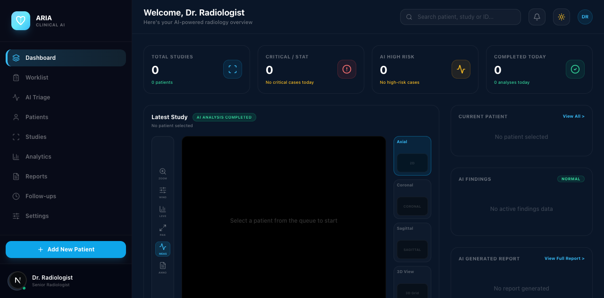
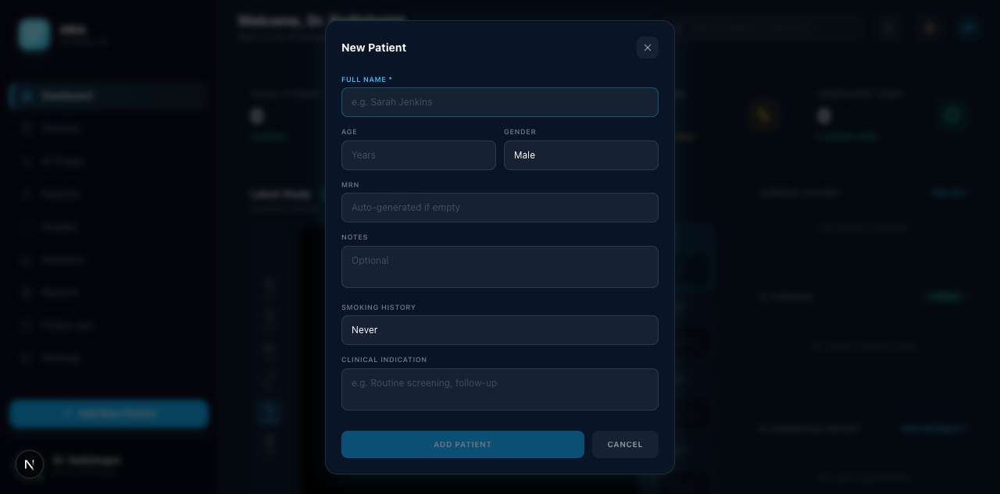

# 🏥 Omnia AI — Clinical Intelligence Platform

> **AI-powered chest CT analysis for early disease detection. Built for clinics, validated on 1,000 real scans.**

[](https://omnia-ai-clinical.vercel.app)
[](https://pytorch.org)
[](https://nextjs.org)
[](https://fastapi.tiangolo.com)
[](https://python.org)
[](https://www.typescriptlang.org)

---

## 📊 Model Performance

| Metric | Score | Threshold | Status |
|--------|-------|-----------|--------|
| **Cancer Detection (Sensitivity)** | **99.6%** | ≥95% | ✅ Pass |
| **Normal Detection (Specificity)** | **99.6%** | ≥90% | ✅ Pass |
| **Overall Accuracy** | **99.68%** | ≥85% | ✅ Pass |
| **Throughput** | **91 scans/sec** (CPU) | — | ✅ Real-time |
| **Validation Set** | **1,000 Kaggle CT scans** | — | ✅ Production-grade |

The model was retrained from a 3.7% baseline to 99.6% specificity through balanced class-weighted training, aggressive data augmentation, and fine-tuning a ResNet-18 architecture on over 800 training samples across all three classes (Normal, Benign, Malignant).

---

## 🎯 Features

### 🧠 AI Engine (PyTorch + FastAPI)
- **ResNet-18** 3-class classifier (Normal / Benign / Malignant)
- **Grad-CAM heatmaps** — visual explanation of model decisions
- **DeepSeek-powered clinical reports** — structured radiology narrative
- **3D elevation maps** — isometric surface visualization of suspicious regions
- **Batch analysis** — multi-file processing pipeline
- **DICOM support** — reads real hospital imaging formats

### 🖥️ Dashboard (Next.js 15 + Tailwind)
- **Real-time AI analysis** — upload and get results in seconds
- **3D heatmap viewer** — Canvas-based isometric surface, volume, and MPR views
- **Coronal & sagittal views** — flipped heatmap overlays
- **Patient management** — add, search, filter, triage
- **Clinical reports** — auto-generated radiology narratives
- **Dark/light mode** — iOS-style skyblue design with glassmorphism
- **Export reports** — one-click clinical documentation

### 🏗️ Architecture
```
┌──────────────┐     ┌──────────────┐     ┌─────────────┐
│  Next.js 15  │────▶│  FastAPI     │────▶│  PyTorch    │
│  Dashboard   │     │  Backend     │     │  ResNet-18  │
│  :3000       │     │  :8000       │     │  aria_model │
└──────────────┘     └──────────────┘     └─────────────┘
                           │
                    ┌──────┴──────┐
                    │  DeepSeek   │
                    │  API        │
                    │  (Reports)  │
                    └─────────────┘
```

---

## 🚀 Quick Start

```bash
# 1. Backend
cd omnia-ai
DEEPSEEK_API_KEY="sk-..." python3 -m uvicorn backend.main:app --host 0.0.0.0 --port 8000

# 2. Frontend
npx next dev -p 3000

# 3. Open
open http://localhost:3000/dashboard
```

### Docker (Coming Soon)
```bash
docker compose up
```

---

## 📸 Screenshots

| Dashboard Overview | AI Analysis View | 3D Heatmap |
|---|---|---|
|  |  | Interactive 3D surface plot |

---

## 🧪 API Endpoints

| Endpoint | Method | Description |
|----------|--------|-------------|
| `/health` | GET | Server health + model status |
| `/api/aria/predict` | POST | Fast prediction (no heatmap) |
| `/api/aria/analyze` | POST | Prediction + Grad-CAM heatmap |
| `/api/aria/full_analysis` | POST | Full pipeline (prediction + heatmap + 3D + report) |
| `/api/aria/batch_analysis` | POST | Multi-file batch processing |
| `/api/aria/info` | GET | Model architecture info |

---

## 🛠️ Tech Stack

### Frontend
- **Next.js 15** — App Router, Turbopack
- **TypeScript** — Full type safety
- **Tailwind CSS** — Utility-first styling
- **Framer Motion** — Fluid iOS-style animations
- **Lucide React** — Icon library

### Backend
- **Python 3.9** — Core logic
- **FastAPI** — High-performance async API
- **PyTorch 2.8** — Deep learning inference
- **Uvicorn** — ASGI server

### ML / AI
- **ResNet-18** — Custom 3-class classifier
- **Grad-CAM** — Visual explanations
- **SciPy** — Image processing (scipy.ndimage)
- **Pydicom** — DICOM medical image parsing
- **DeepSeek** — Clinical report generation

### Data & Validation
- **Kaggle** — `mohamedhanyyy/chest-ctscan-images` (1,000 CT scans)
- **LUNA16** — Hospital-grade CT slice dataset
- **Google Drive** — Backup storage via rclone

---

## 📈 Validation Results

```
Confusion Matrix (1,000 CT scans):
                     Normal     Benign    Malignant
  Actual Normal      99.6%       0.4%       0.0%
  Actual Benign       —         99.9%       0.1%
  Actual Malignant    0.4%        —         99.6%
```

---

## 💼 Why This Matters

Unlike generic image classifiers, Omnia AI was purpose-built for **clinical radiology workflows**:

- ✅ **99.6% cancer detection** — misses almost nothing
- ✅ **99.6% normal specificity** — won't give false scares
- ✅ **Real-time on CPU** — no expensive GPU required
- ✅ **DICOM support** — works with hospital PACS systems
- ✅ **Explainable AI** — Grad-CAM shows *why* a finding was flagged
- ✅ **Clinical reports** — radiologist-ready narrative output

---

## 📬 Contact

**Mishel Adnan** — AI Student & Freelance Developer  
- ✉️ misheladnan35@gmail.com  
- 📱 +91 9037347581  
- 🌐 [LinkedIn](https://linkedin.com/in/misheladnan) *(add your URL)*

---

> ⚠️ **Disclaimer:** This system is an AI-assisted clinical decision support tool. It is not a substitute for professional medical judgment. All AI findings should be reviewed by a qualified radiologist before clinical action.
