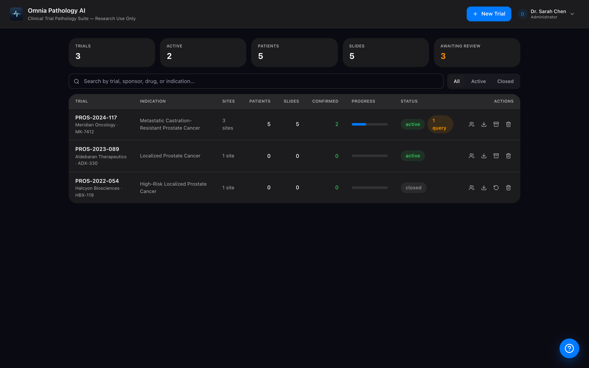
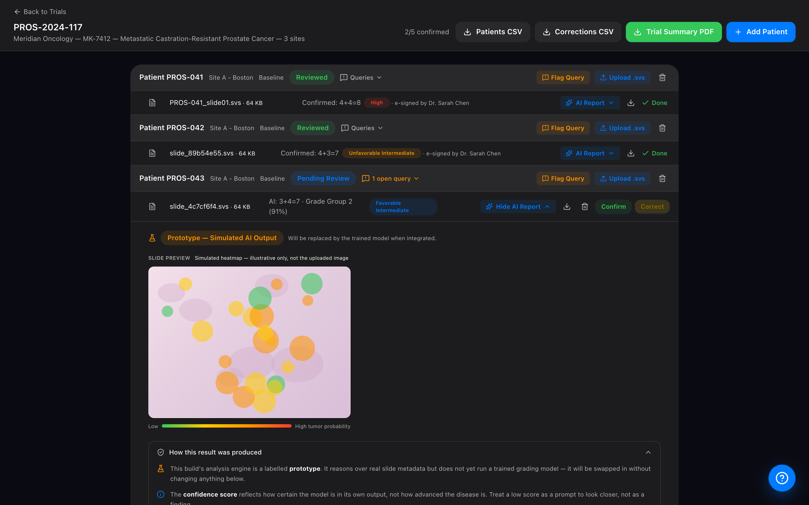
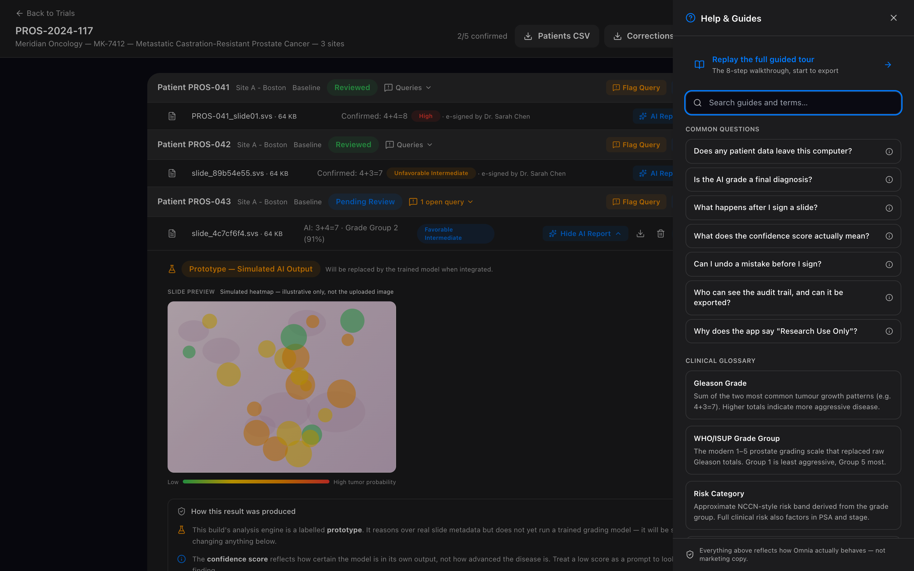
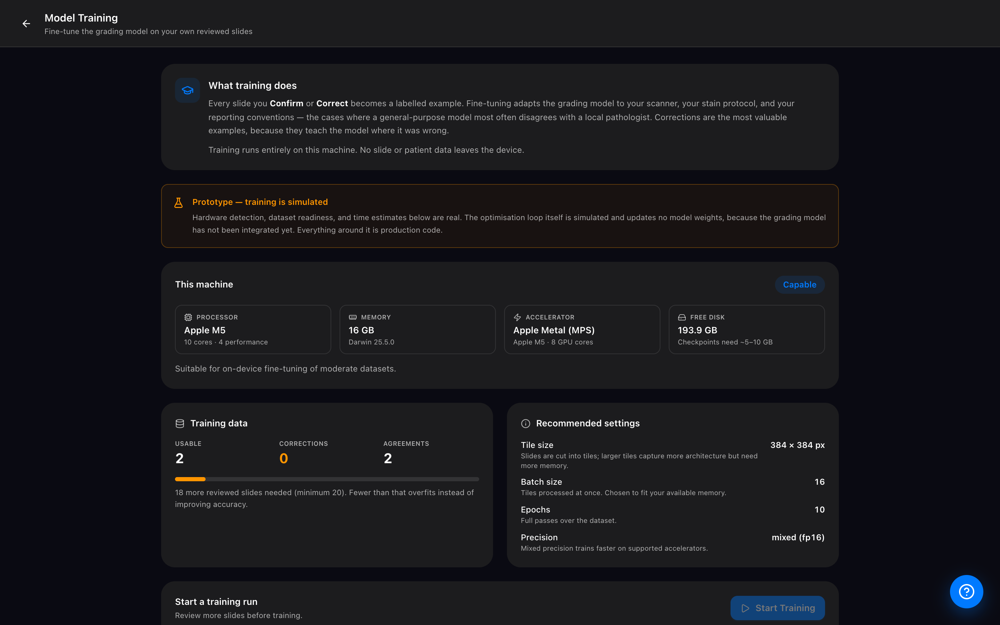
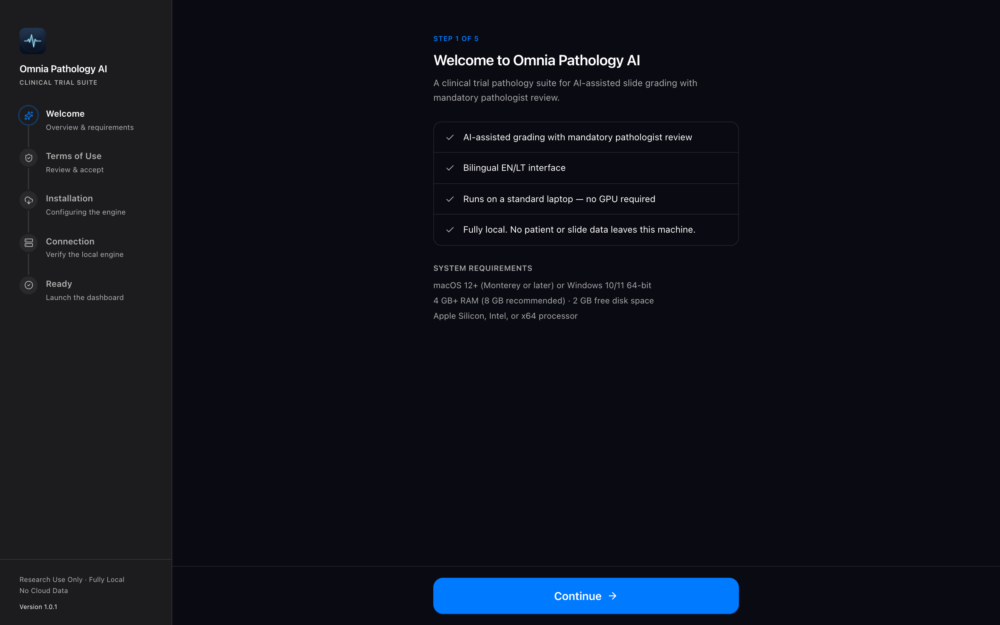
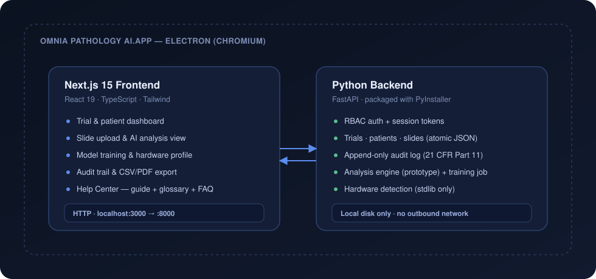

<p align="center">
  
</p>

<h1 align="center">Omnia Pathology AI</h1>

<p align="center">
  A clinical trial pathology <strong>research</strong> suite for AI-assisted prostate slide grading, with mandatory pathologist review, an immutable audit trail, and electronic signatures.
</p>

<p align="center">
  
  
  
  
  
  
</p>

<p align="center">
  <a href="#research-status">Research Status</a> •
  <a href="#what-it-does">What It Does</a> •
  <a href="#screenshots">Screenshots</a> •
  <a href="#the-model">The Model</a> •
  <a href="#quick-start">Quick Start</a> •
  <a href="#download">Download</a> •
  <a href="#architecture">Architecture</a> •
  <a href="#security--compliance">Security & Compliance</a>
</p>

---

## Research Status

**This is a research project, not a medical product.** Omnia Pathology AI exists to prototype the *workflow* a clinical-trial pathology core lab needs — trial/patient management, slide review, e-signature, audit trail, sponsor exports — around an AI grading step. It is explicitly **not**:

- A certified or FDA/CE-cleared diagnostic device
- Validated against a real pathology dataset — the shipped analysis engine is a **labelled prototype** that produces simulated grades (see [The Model](#the-model))
- Intended to inform an actual patient's care or treatment in its current state

Every AI output in the app is visibly marked `Prototype — Simulated AI Output`, and the entire review/signature workflow exists specifically so a human, not the model, is accountable for any real grade. Treat this repository as a research and engineering artifact: an honest, working scaffold for what a production clinical-trial pathology tool would need, ready for a validated model to be dropped in.

---

## What It Does

Omnia Pathology AI runs the full workflow a pathology core lab needs to grade prostate biopsy slides across a multi-site clinical trial:

| Area | What it covers |
|---|---|
| **Trials & patients** | Multi-site trials, patients tracked per visit (Baseline, Week 12, End of Treatment, …), duplicate-visit protection |
| **Whole-slide images** | Streamed `.svs` upload — large scans never held fully in memory |
| **AI-assisted grading** | Gleason score, WHO/ISUP Grade Group, tumour burden, perineural/lymphovascular invasion, cribriform pattern, a biomarker panel, and an NCCN-style risk group |
| **Mandatory review** | No AI result is final — a pathologist must **Confirm** or **Correct** every grade, re-entering their password as an electronic signature |
| **Audit trail** | Every sign-in, edit, analysis, signature, and query is written to an append-only log in 21 CFR Part 11 style, exportable as CSV |
| **Discrepancy queries** | Flag, respond to, and close queries against a patient — visible on both the trial list and patient row until resolved |
| **Role-based access** | Administrator, Pathologist, Monitor/CRA, and read-only Sponsor roles |
| **Exports** | Per-slide pathology PDFs, a trial summary report, and CSV extracts of patients and graded corrections |
| **Model training** | Scans the host's actual hardware (CPU/GPU/RAM), recommends a training configuration, and estimates run time before fine-tuning on pathologist-confirmed slides |
| **In-app guidance** | A searchable Help Center (glossary + FAQ) and an 8-step guided tour, so a doctor never has to guess what a screen is for |

Everything runs **fully local** — trial, patient, and slide data never leaves the machine it's installed on.

## Screenshots

<p align="center">
  
  <br/><sub>Trial dashboard — portfolio totals, status, and open queries at a glance</sub>
</p>

<p align="center">
  
  <br/><sub>AI analysis panel, expanded — prototype labelling and a "how this result was produced" disclosure on every result</sub>
</p>

<table>
  <tr>
    <td width="50%"><br/><sub align="center">Searchable Help Center — FAQ + clinical glossary</sub></td>
    <td width="50%"><br/><sub>Model training — real hardware detection, honestly labelled as simulated</sub></td>
  </tr>
  <tr>
    <td width="50%"><br/><sub>Append-only audit trail, exportable as CSV</sub></td>
    <td width="50%"><br/><sub>First-run install wizard</sub></td>
  </tr>
</table>

## The Model

The analysis engine shipped in this build is a **clearly-labelled prototype** — every slide it grades is marked `Prototype — Simulated AI Output` in the UI, and the workflow around it (upload → analyze → review → sign → audit) is what's actually final. The trained grading model plugs into the same contract without changing anything else: `collect_training_examples()` in [`backend/training.py`](backend/training.py) already assembles every pathologist-confirmed slide into a labelled training set, ready for a real fine-tuning loop to replace the current simulated one.

## Quick Start

### Prerequisites
- macOS 12+ (Apple Silicon or Intel) or Windows 10/11 64-bit
- 4 GB RAM minimum (8 GB recommended), 2 GB free disk space
- No GPU required

### Option 1 — Download (Recommended)

Grab the latest installer from the [Releases page](https://github.com/mishel-0/Omnia-AI/releases):

- **macOS**: `Omnia Pathology AI-x.x.x-arm64.dmg` — drag into Applications
- **Windows**: `Omnia Pathology AI Setup x.x.x.exe` — run the installer

### Option 2 — Run from Source

```bash
git clone https://github.com/mishel-0/Omnia-AI.git
cd Omnia-AI

# Backend
python3 -m venv .venv
source .venv/bin/activate      # Windows: .venv\Scripts\activate
pip install -r requirements.txt
python3 -m backend.main

# Frontend (in another terminal)
npm install
npm run dev
```

Open `http://localhost:3000` — the first run walks you through creating an administrator account.

## Download

| Platform | Package |
|---|---|
| macOS (Apple Silicon / Intel) | `.dmg` on the [latest release](https://github.com/mishel-0/Omnia-AI/releases/latest) |
| Windows | `.exe` (NSIS installer) on the [latest release](https://github.com/mishel-0/Omnia-AI/releases/latest) |

Both are built by [`.github/workflows/release.yml`](.github/workflows/release.yml) on every `vX.Y.Z` tag, from the exact same [`scripts/build-desktop.sh`](scripts/build-desktop.sh) a developer runs locally — so what ships is what was actually tested, on both platforms.

## Architecture

<p align="center">
  
</p>

| Component | Technology | Purpose |
|---|---|---|
| Frontend | Next.js 15, React 19, TypeScript, Tailwind | UI |
| Backend | Python 3.12, FastAPI | API, auth, data layer |
| Storage | Atomic-write JSON files | Local-first, crash-safe (no DB required) |
| Desktop | Electron, PyInstaller, electron-builder | Standalone `.dmg` / `.exe` |
| Hardware detection | stdlib only (`sysctl`/`system_profiler`/`/proc`/`wmic`) | Training config recommendations |

Storage writes go through a temp-file + `fsync` + atomic-rename pattern with a process-wide lock (see [`backend/storage.py`](backend/storage.py)), so a crash mid-write can never corrupt trial data.

## Security & Compliance

- **Local-first** — no patient or slide data is ever uploaded to a cloud service
- **Electronic signatures** — confirming or correcting a grade requires the pathologist's password; signed slides can't be re-analysed, edited, or deleted
- **Append-only audit trail** — every action is logged with actor, timestamp, and entity, in 21 CFR Part 11 style
- **Role-based access control** — write access limited to Admin/Pathologist; audit access limited to Admin/Monitor
- **Research Use Only** — the shipped analysis engine is a labelled prototype, not a certified diagnostic device

## Development

```bash
npm run desktop:build:mac    # macOS DMG
npm run desktop:build:win    # Windows EXE
npm run test                 # Backend integration test suite
npm run type-check           # TypeScript
npm run lint                 # Lint
```

`npm run desktop:build` (via [`scripts/build-desktop.sh`](scripts/build-desktop.sh)) gates the package step on the same test suite CI runs — a build never ships without passing tests first.

## License

MIT — see [LICENSE.txt](LICENSE.txt) for details.

---

<p align="center">
  Built for clinical trial pathology core labs. Runs entirely on-premises.
</p>
