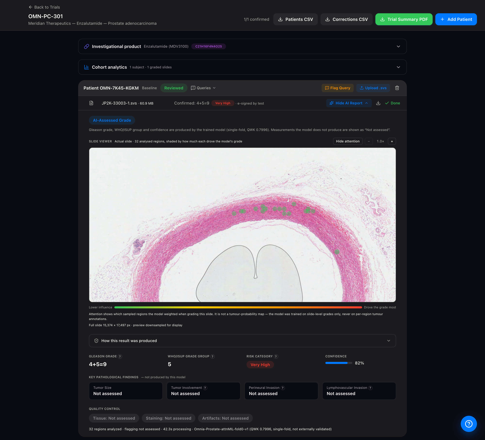
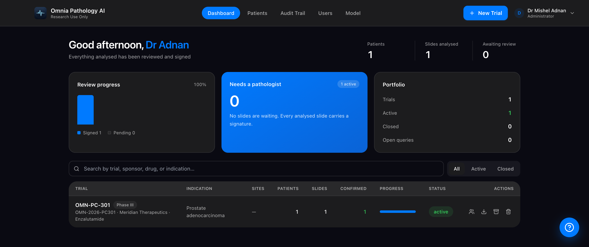
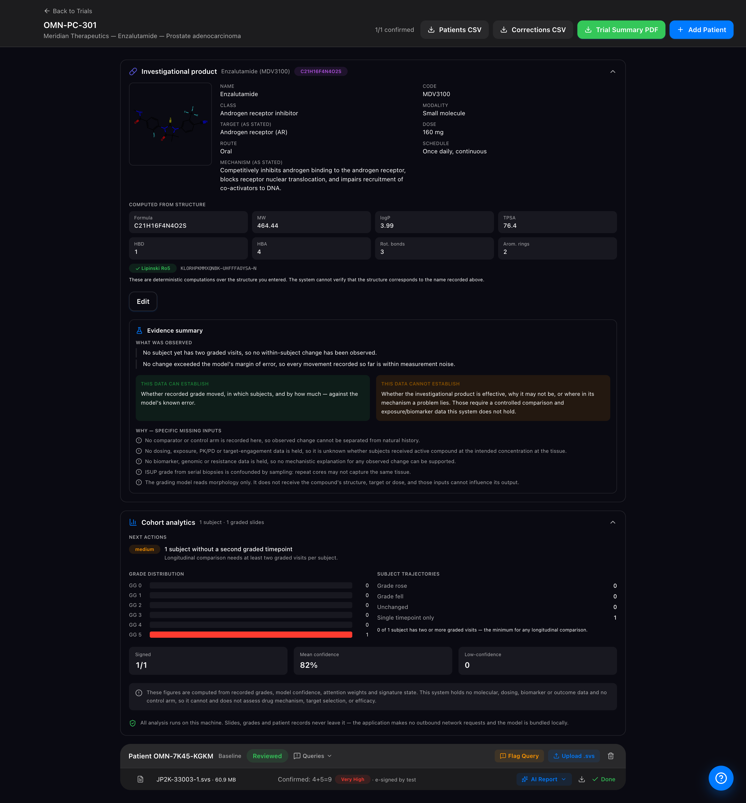
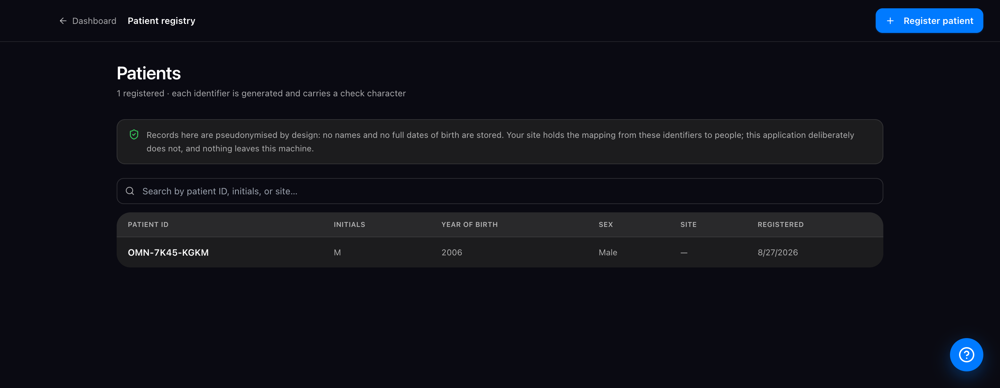
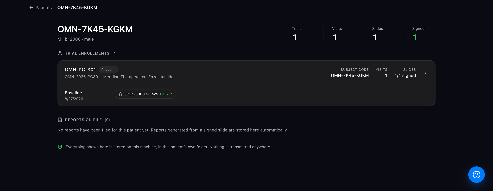
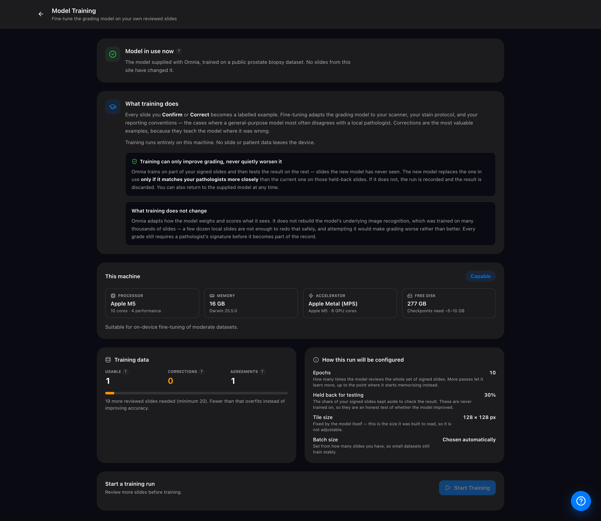
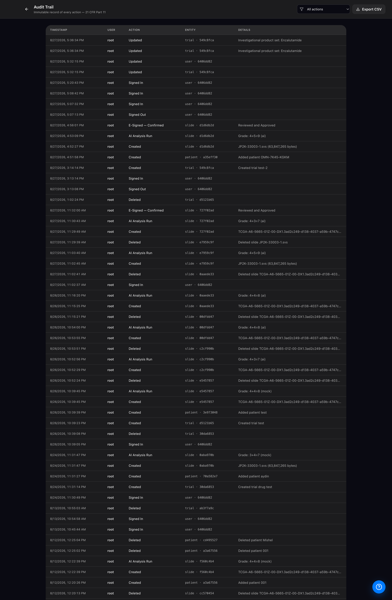

<p align="center">
  
</p>

<h1 align="center">Omnia Pathology AI</h1>

<p align="center">
  A clinical-trial pathology suite for AI-assisted prostate biopsy grading —
  with mandatory pathologist sign-off, an immutable audit trail, and on-site
  model fine-tuning. Runs entirely offline.
</p>

<p align="center">
  
  
  
  
  
  
</p>

<p align="center">
  <a href="#what-this-is">What this is</a> •
  <a href="#screenshots">Screenshots</a> •
  <a href="#performance">Performance</a> •
  <a href="#the-model">The model</a> •
  <a href="#on-site-fine-tuning">Fine-tuning</a> •
  <a href="#architecture">Architecture</a> •
  <a href="#download">Download</a> •
  <a href="#limitations">Limitations</a>
</p>

---

## What this is

A pathology core lab running a multi-site prostate cancer trial has to grade
thousands of biopsy slides consistently, keep a regulator-grade record of who
decided what, and never let an automated result reach a report without a
pathologist standing behind it.

Omnia is that workflow, built around a real grading model that runs on the
laboratory's own machine. No slide, patient record or grade ever leaves the
device — the application makes **no outbound network requests** and the model
is bundled locally.

| | |
|---|---|
| **Grading** | Attention-MIL model over whole-slide images, producing an ISUP grade group (0–5) with a per-tile attention map showing which tissue drove the result |
| **Mandatory review** | No grade is final. A pathologist must Confirm or Correct every result, re-entering their password as an electronic signature |
| **Patient records** | Each patient gets a generated, check-digit-protected ID and a container holding their visits, slides and issued reports across every trial they join |
| **On-site fine-tuning** | Signed slides become training data. The model adapts to your scanner and stain — but only if it measurably improves (see below) |
| **Audit trail** | Append-only log of every sign-in, upload, analysis, signature and query, in 21 CFR Part 11 style, exportable as CSV |
| **Investigational product** | Structure-derived chemistry (RDKit) with an explicit statement of what the recorded data can and cannot establish |
| **Self-repair** | Five supervised background workers recover interrupted runs, clear partial writes, cap caches and reload a failed model |

---

## Screenshots

<p align="center">
  
  <br/><sub><b>AI analysis with attention overlay</b> — the model's grade on a real 60.9 MB whole-slide image,
  with the 32 sampled regions shaded by how much each drove the result. Fields the model does not produce
  are shown as "Not assessed" rather than filled in.</sub>
</p>

<p align="center">
  
  <br/><sub><b>Trial dashboard</b> — what is done, what needs a pathologist, and the trial portfolio</sub>
</p>

<p align="center">
  
  <br/><sub><b>Trial detail</b> — chemistry computed from the recorded structure, cohort analytics, and an explicit account of what the data cannot establish</sub>
</p>

<table>
  <tr>
    <td width="50%">
      
      <br/><sub><b>Patient registry</b> — generated IDs, pseudonymised by design</sub>
    </td>
    <td width="50%">
      
      <br/><sub><b>Patient record</b> — every trial, visit, slide and report for one person</sub>
    </td>
  </tr>
  <tr>
    <td width="50%">
      
      <br/><sub><b>Fine-tuning</b> — real hardware detection and a promotion gate</sub>
    </td>
    <td width="50%">
      
      <br/><sub><b>Audit trail</b> — append-only, exportable</sub>
    </td>
  </tr>
</table>

---

## Performance

**Quadratic weighted kappa: 0.7996** on a held-out split of the PANDA
(Prostate cANcer graDe Assessment) dataset.

| | |
|---|---|
| **Metric** | Quadratic weighted kappa (QWK) |
| **Score** | **0.7996** |
| **Task** | ISUP grade group 0–5 from a whole-slide image |
| **Dataset** | PANDA — ~10,600 prostate biopsy WSIs, Radboud + Karolinska |
| **Evaluation** | Held-out split, single fold |
| **Inference** | ~42 s per slide, CPU only (Apple M5, no dedicated GPU) |

QWK is the metric prostate grading is scored on, because grades are ordinal:
calling a grade 5 slide "grade 1" is a far worse error than calling it
"grade 4", and plain accuracy treats those identically. QWK weights errors by
the square of how far off they are. 1.0 is perfect, 0 is chance.

**Where this sits.** Gleason grading is genuinely hard to agree on — published
inter-observer studies typically report kappa in the 0.6–0.8 range between
pathologists on the same slides. 0.7996 is inside that band. The top PANDA
challenge entries went higher, around 0.9 on the internal leaderboard, using
large ensembles and far more training compute than a single-fold model trained
on a fixed budget. This is a strong single-model baseline, not state of the art,
and it is stated that way deliberately.

**Scope of the number.** One fold, one dataset, no external validation on
slides from a different scanner or laboratory. That describes how much has been
measured — it is not a hedge about the score itself. 0.7996 is this model's
real, measured performance on that evaluation. External-cohort validation is
the work that would be required before any clinical claim.

### Sample output

Real output from this model, included in the repository:

- [`assets/sample-output/JP2K-33003-1_analysis.json`](assets/sample-output/JP2K-33003-1_analysis.json)
  — full analysis of a 60.9 MB whole-slide image: Gleason 4+5=9, ISUP grade
  group 5, 82.3% confidence, 42.3 s, plus all 32 per-tile attention weights
  showing which tissue drove the grade
- [`assets/sample-output/OMN-PC-301_OMN-7K45-KGKM_Baseline_report.pdf`](assets/sample-output/OMN-PC-301_OMN-7K45-KGKM_Baseline_report.pdf)
  — the signed pathology report generated from that analysis

Both are genuine model output on a public slide, not synthetic examples — the
attention overlay at the top of this README is the same analysis, rendered.

## The model

**Architecture.** Gated attention multiple-instance learning (Ilse et al.,
2018) over an EfficientNet-B0 backbone. A whole-slide image is sampled into 32
tissue tiles at 128 px; the backbone embeds each tile; a gated attention head
learns which tiles matter and pools them into one slide-level embedding;
parallel regression and classification heads produce the grade. The attention
weights are surfaced in the interface as the regions that drove the result, so
a pathologist can check *where* the model was looking rather than being handed
a number.

**Training.** Macenko stain normalisation to reduce scanner and protocol
variation, and 8-way dihedral test-time augmentation at inference.

## On-site fine-tuning

Every slide a pathologist signs becomes a labelled example. Fine-tuning trains
the attention and classifier heads on those labels, leaving the backbone frozen.

Freezing the backbone is a real constraint rather than a shortcut: a site with a
few dozen reviewed slides has a few dozen labels, and fitting four million
backbone parameters to that memorises them and generalises worse. The heads are
small enough to train honestly at that data scale, on a clinic's CPU.

**The safeguard that matters.** A fine-tune is trained on part of the signed
slides and measured on a held-out part it never saw. It replaces the live model
**only if it agrees with the pathologist better** than the current model does on
those held-back slides. A run that would make grading worse is recorded and
discarded. Reverting to the shipped model is one click and never deletes
anything.

---

## Architecture

```
┌─ Electron shell ──────────────────────────────────────────┐
│  desktop/main.js — supervises both servers, reclaims       │
│  orphaned ports, cleans up child processes on quit         │
│                                                            │
│  ┌─ Next.js 15 (App Router) ──┐  ┌─ FastAPI ────────────┐  │
│  │  app/dashboard/*           │→ │  backend/main.py     │  │
│  │  React 19 + Tailwind       │  │  routes/*            │  │
│  └────────────────────────────┘  └──────────┬───────────┘  │
│                                             │              │
│                    ┌────────────────────────┼───────────┐  │
│                    ▼                        ▼           ▼  │
│            grading_model.py          finetune.py   workers │
│            AttentionMIL              head training   ×5     │
│            openslide + torch         promotion gate         │
│                    │                        │               │
│                    ▼                        ▼               │
│            JSON store + per-patient containers on disk      │
└────────────────────────────────────────────────────────────┘
```

**Notable pieces**

| File | What it solves |
|---|---|
| [`backend/grading_model.py`](backend/grading_model.py) | Inference: lazy tile reads so a 60 GB slide is never held in memory, semaphore-bounded concurrency, deterministic tile sampling, disk-cached thumbnails |
| [`backend/finetune.py`](backend/finetune.py) | Head-only fine-tuning, stratified split, QWK, and the promotion gate |
| [`backend/patients.py`](backend/patients.py) | Patient registry — Crockford Base32 IDs with a Luhn mod-32 check character |
| [`backend/workers.py`](backend/workers.py) | Supervised background workers with crash isolation, backoff and health reporting |
| [`tests/integration_api_test.py`](tests/integration_api_test.py) | 132 integration tests, including guards that fail if fabricated data or efficacy claims ever return |

**Patient identifiers** are generated, never typed. They carry a check
character, so a mistyped ID is *rejected* rather than silently resolving to a
different patient — the dangerous failure here is not "not found", it is "found,
wrong person". Measured: 0 undetected single-character substitutions in 74,400
mutations. (Adjacent transpositions: ~0.1% slip through, the known Luhn limit.)

---

## Download

Installers are attached to the [latest release](https://github.com/mishel-0/Omnia-AI/releases/latest).

- **macOS (Apple Silicon)** — `Omnia-Pathology-AI-<version>-arm64.dmg`
- **Windows 10/11 (x64)** — `Omnia-Pathology-AI-Setup-<version>.exe`

The app ships with a **60-day evaluation licence**. The licence screen issues
one on first run; the interface shows the days remaining throughout.

> The licence check is deterrence, not access control. The validator ships with
> the app, so it can be bypassed. Real enforcement would need server-side
> activation — this is documented rather than dressed up.

### Run from source

```bash
git clone https://github.com/mishel-0/Omnia-AI.git
cd Omnia-AI

python3 -m venv .venv && source .venv/bin/activate   # Windows: .venv\Scripts\activate
pip install -r requirements.txt
npm install

npm run dev                    # frontend on :3000
python3 -m backend.main        # backend on :8000
```

Requires Python 3.12, Node 20+, and `openslide` (`brew install openslide`).

```bash
python3 tests/integration_api_test.py    # 132 tests, spins up its own server
```

---

## Limitations

Stated plainly, because a medical tool that oversells itself is worse than one
that does less.

- **Research use only.** Not a certified or cleared diagnostic device. Not for
  clinical decision-making.
- **Prostate only.** The model grades prostate histology. Registering a trial
  with another indication is allowed and warned about — no grade is produced.
- **One fold, one dataset, no external validation.** QWK 0.7996 is measured
  performance on a held-out PANDA split. It has not been validated on external
  cohorts, so it does not support a clinical performance claim.
- **The model reads pixels and nothing else.** It cannot assess whether a drug
  is working, why it is not, or where in a mechanism a problem lies. Those need
  a control arm, dosing/PK-PD and biomarker data that this system does not hold.
  The interface states this where it would otherwise be tempting to infer.
- **Grade change ≠ treatment response.** Serial biopsies are confounded by
  sampling; the longitudinal view reports change and refuses to interpret it.

---

## License

MIT — see [LICENSE.txt](LICENSE.txt).

Built by [@mishel-0](https://github.com/mishel-0).
